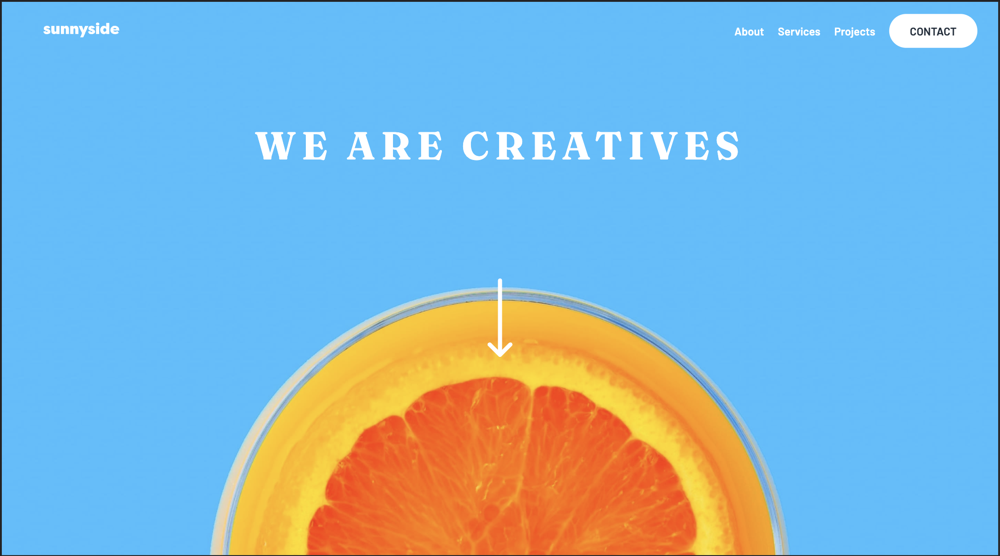

# Frontend Mentor - Sunnyside agency landing page solution

This is a solution to the [Sunnyside agency landing page challenge on Frontend Mentor](https://www.frontendmentor.io/challenges/sunnyside-agency-landing-page-7yVs3B6ef). Frontend Mentor challenges help you improve your coding skills by building realistic projects.

**Note: Delete this note and update the table of contents based on what sections you keep.**

### Screenshot

### Links

- Solution URL: (https://www.frontendmentor.io/challenges/sunnyside-agency-landing-page-7yVs3B6ef/hub)
- Live Site URL: (https://startling-faun-a85da9.netlify.app/)

### Built with

- Semantic HTML5 markup
- CSS custom properties
- Flexbox

## Author

- Website - [Valeriia Isaienko](https://valeriia-code.com)
- Frontend Mentor - [@Magic1vy](https://www.frontendmentor.io/profile/Magic1vy)
- LinkedIn - [Valeriia Isaienko](https://www.linkedin.com/in/valeriia-code)
